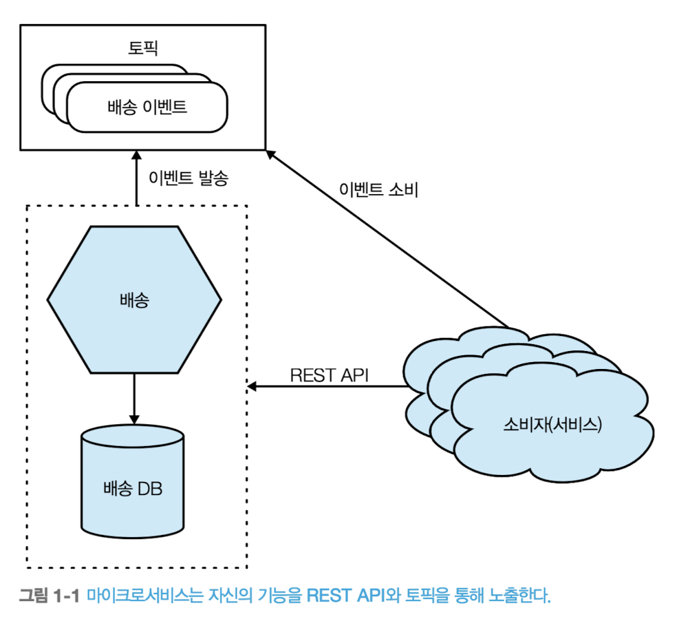
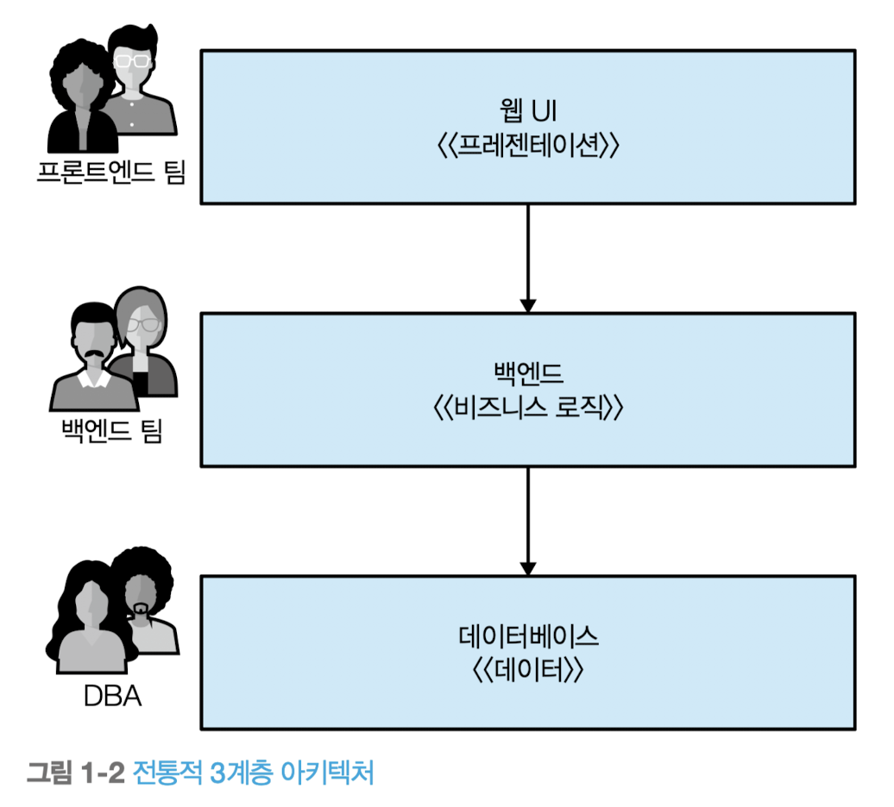

# 마이크로서비스란?

마이크로서비스는 서비스 지향 아키텍처의 한 종류로, 비즈니스 도메인에 따라 모델링된 서비스는 독립적으로 릴리스 가능하다는 특징을 지닌다. 기능을 캡슐화하고 네트워크를 통해 다른 서비스들에 엑세스하게 해준다.

## 1.1. 살펴보기

`직면한 문제`를 해결하기 위해 `다양한 옵션`을 제공하는 데 중점을 둔 아키텍처다.

- 서비스 경계를 정하는 방법
- 독립적인 배포 가능성
- 기술 중립적이다.

### 분산된 시스템간 통신



외부에서 보면, 하나의 마이크로서비스는 블랙박스로 취급된다.

네트워크 엔드포인트는 메시징 시스템이나 REST API를 통해 비즈니스 기능을 호스팅한다. 소비자는 외부 시스템(다른 마이크로서비스든 또는 다른 종류의 프로그램)의 기능(또는 서비스)은 네트워크로 연결된 엔트포인트를 통해 접근한다. 

### 공유 데이터 베이스 사용 지양

서비스 기능 기술이나, 데이터 저장 방식과 같은 상세한 내부 구현 정보는 외부 세계에서 완전히 은폐된다.

이 점은 마이크로서비스 아키텍처가 대부분의 상황에서 공유 데이터베이스의 사용을 지양하는 것을 의미한다.

### 정보 은닉

마이크로서비스는 정보 은닉이라는 개념을 수용한다.

- 가능한 많은 정보를 구성 요소에 감춘다.
- 외부 인터페이스를 통해 최소한의 정보만 노출한다.

이 개념은 변경하기 쉬운 것과 변경하기 어려운 것을 명확히 구분하게 해준다.

경계 외부의 변경은 하휘 호환을 고려하여 변경이 드믄 최소한의 정보만 노출되도록 인터페이스를 구성한다. 경계 내부의 변경은 업스트림 소비자에게 영향이 미치지 않으므로 독립적인 기능 릴리스가 가능하다.

내부 구현의 정보 은닉에 대해선 알리스테어콕번의 헥사고날 아키텍처의 철학을 살펴보면 좋다. 다른 유형의 인터페이스를 통해 동일한 기능과 상호작용할 수 있다는 생각을 바탕으로 내부 구현과 외부 인터페이스를 분리하는 것이 왜 중요한지를 설명한다.

## 1.2. 마이크로서비스의 핵심 개념

마이크로서비스를 탐구할 때는 몇 가지 핵심 개념을 이해해야 한다.

- 독립적 배포성
- 비즈니스 모델 중심의 모델링
- 자기 상태 소유
- 크기
- 유연성
- 아키텍처와 조직의 정렬
- 

### 1.2.1. 독립적 배포성

독립적 배포성(independent deployability)은 다른 마이크로서비스를 배포하지 않고도 마이크로서비스를 변경하고, 배포하고, 사용자에게 릴리스할 수 있다는 개념이다.

독립적 배포를 위해선, 마이크로서비스를 느슨하게 결합(loosely coupled)시켜야 한다. 즉 다른 서비스를 변경하지 않고도 한 서비스를 변경할 수 있어야한다. 이는 서비스간에 분명하고 잘 정의되며, 안정적인 계약이 필요하다는 것을 의미한다. 특히 서비스간 데이터베이스 공유 구현 방법은 문제가 된다.

안정적인 인터페이스를 갖고 느슨하게 결합된 서비스를 요구하는 목소리가 커지면서 마이크로서비스 경계를 찾는 방법을 가장 먼저 생각하게 됐다.

### 1.2.2. 비즈니스 모델 중심의 모델링

도메인 주도 설계와 같은 기술을 사용하면 소프트웨어가 동작하는 실제 도메인을 더 잘 표현하도록 코드를 구성할 수 있다.

마이크로서비스에서는 동일한 개념을 사용해 서비스 경계를 정의한다. 비즈니스 도메인을 중심으로 서비스를 모델링함으로써 새로운 기능(feature)을 좀 더 쉽게 출시하고 마이크로서비스를 다양한 방식으로 재결합해 사용자에게 새로운 기능을 제공할 수 있다.

둘 이상의 마이크로서비스를 변경해야 하는 제품 기능을 출시하려면 비용이 많이 든다. 각 서비스와(어쩌면 분리된 팀과도) 작업을 조율해야 하고 해당 서비스들의 새 버전이 배포되는 순서를 주의 깊게 관리해야 한다. 단일 서비스(또는 모듈리스) 내부에서 동일한 변경을 수행하는 것보다 훨씬 더 많은 작업이 필요하다. 따라서 가능한 한 서비스 간 변경을 적게 수행할 수 있는 방법을 선호한다.

#### 응집력: 기술적 기능의 응집력보다 비즈니스 기능의 높은 응집력을 높여라



계층형 아키텍처의 각 계층은 관련된 기술적 기능을 기반으로 하는 각 서비스 경계를 포함해 서로 다른 서비스 경계를 나타낸다.

기능 변경은 대개 여러 계층에 걸처 나타나 프레젠테이션, 애플리케이션, 데이터 계층의 변경이 필요하다. 이러한 문제는 아키텍처의 간단한 예보다 훨씬 더 계층화되면 심각해진다. 

서비스를 비즈니스 기능 단위로 (수직으로) 처음부터 끝까지 한 조각으로 만들면, 비즈니스 기능을 최대한 효율적으로 변경하도록 아키텍처를 배치할 수 있다. 우리는 마이크로서비스에서 기술적 기능의 응집력보다 비즈니스 기능의 높은 응집력을 더 우선시하기로 결정했다.

### 1.2.3. 자기 상태 소유

마이크로서비스가 공유 데이터베이스 사용을 피해야 한다는 생각은 많은 사람을 힘들게 한다.

- 외부 시스템의 데이터에 엑세스하려면 데이터 요청을 해야한다.
- 이는 마이크로서비스에 어떤 데이터를 공유하고 감출지 결정한다.
  - 내부 구현은 자유롭게 변경
  - 외부 계약은 소비자가 사용하는 기능으로, 변경되지 않은 기능

독립적 배포성을 실현하려면 마이크로서비스에 대한 하위 호환성이 없는 변경을 제한해야 한다. 만약 업스트림 소비자와의 호환성을 깨뜨리면 소비자들에게도 변경을 강요할 것이다. 마이크로서비스에 대한 내부 구현 상세와 외부 계약을 명확하게 구분하면 하위 호환성이 없는 변경을 줄이는데 도움이 된다.

- 정말 필요한 경우가 아니라면 데이터베이스를 공유하지 말라.
- 그리고 공유를 회피하기 위해 할 수 있는 모든 것을 수행하라.
- 데이터베이스 공유는 독립적 배포성을 달성하는 데 가장 나쁜 것 중 하나다.

### 1.2.4 크기

마이크로서비스는 얼마나 커야 할까요? 크기는 어떻게 측정할까?

```text
'마이크로서비스는 내 머리만큼 커야 한다' 
- 제임스 루이스(James Lewis, 소트윅스(thoughtworks)의 기술 책임자)
```

쉽게 이해할 수 있는 크기로 유지해야 한다. 사람마다 이해하는 능력이 같지 않기 때문에 스스로 어떤 크기가 적절한지 판단해야 한다.

```text
마이크로서비스의 목적은 가능한 작은 인터페이스를 갖는 것
- 크리스 리차드슨(Chris Richardson, 마이크로서비스 패턴 저자)
```

작은 인터페이스란 정보 은닉의 개념과 연결된다.

결과적으로 크기의 개념은 상황에 크게 좌우된다. 크기에 대한 걱정보다는 마이크로서비스로 향하는 여정을 시작할 때, 다음 두 가지 핵심 사항에 집중하는 것이 훨씬 더 중요하다.

- 얼마나 많은 마이크로서비스를 처리할 수 있는가?
  - 서비스가 많을수록 시스템의 복잡성이 증가하고, 이에 대처하려면 새로운 기술을 배워야 한다. (그리고 아마도 그 기술을 채택해야 할 것이다.)
  - 마이크로서비스로의 전환은 복잡성을 유발하는 근원이 되며 이로 인해 발생할 수 있는 모든 문제를 야기한다.
  - 점진적으로 전환해야 한다고 강력히 주장한다.
- 모든 것이 끔찍하게 결합돼 엉망인 상황을 피하면서 마이크로 서비스 경계를 최대한 활용하려면 어떻게 경계를 정의해야 하는가?

### 1.2.5 유연성

```text
'마이크로서비스는 선택권을 제공한다'
- 제임스 루이스(James Lewis, 소트윅스(thoughtworks)의 기술 책임자)
```

마이크로서비스는 비용이 들기 때문에 그 비용이 선택하려는 옵션의 가치에 견줘 적당한지 따져봐야 한다.

- 유연성은 조직성
- 기술성
- 규모
- 견고함

모든 문제를 해결하는 데 유연하게 대처할 수 있는 아키텍처를 원한다. 선택의 폭을 넓히는 것과 이와 같은 아키텍처에 대한 비용 부담 사이에서 규현을 찾는 것은 매우 절묘한 일이다.

마이크로서비스를 도입하는 것은 스위치를 한 번에 켜는 것이 아니라 다이얼을 천천히 돌리는 것에 비유해야 한다. 다이얼을 돌리면서, 즉 마이크로서비스 수가 많아질수록 유연성은 증가하지만 고충도 함께 널어날 가능성이 높다. 이러한 이유로 필자는 점진적인 마이크로서비스 도입을 강력히 지지한다.

### 1.2.6 아키텍처와 조직의 정렬


