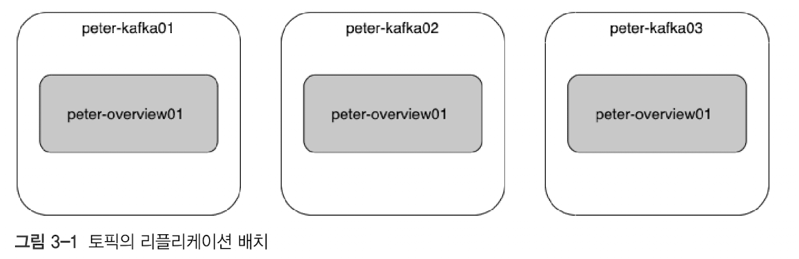
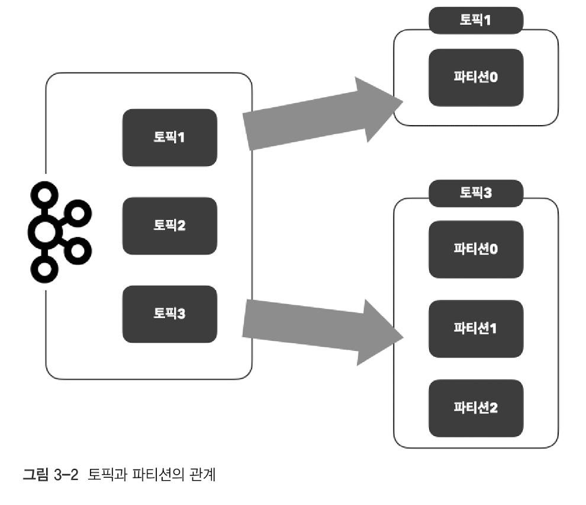
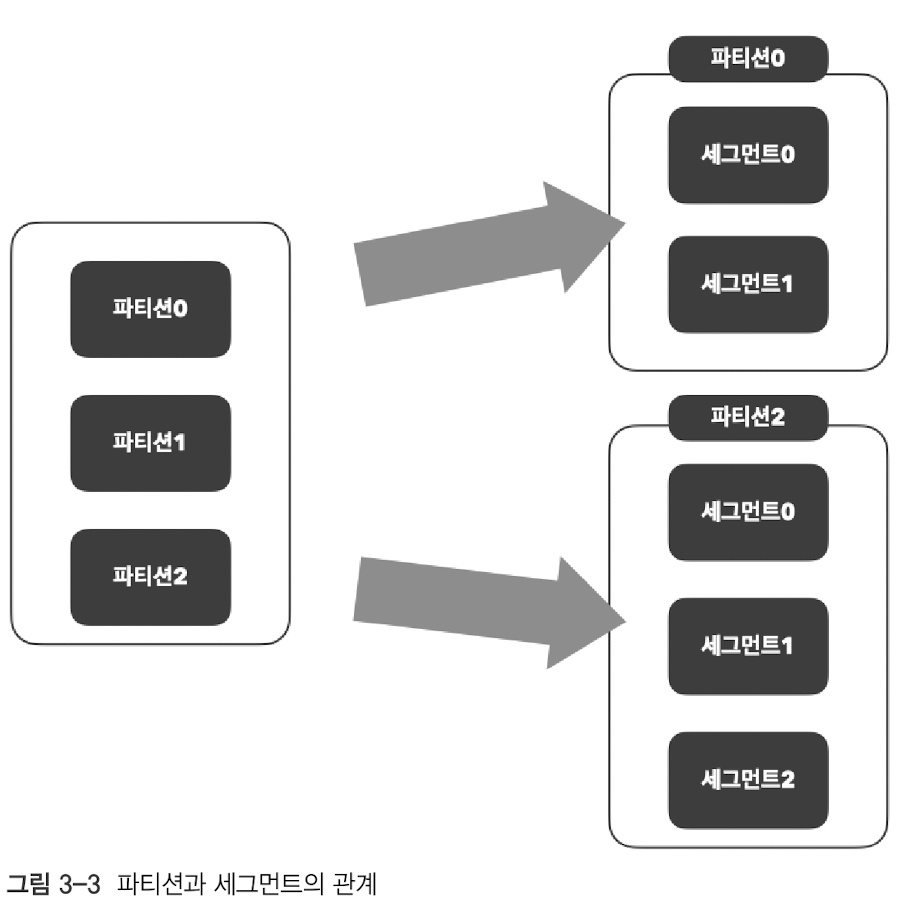
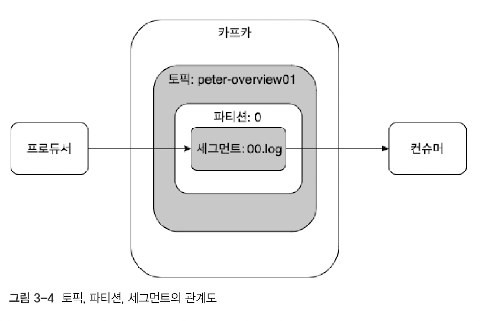
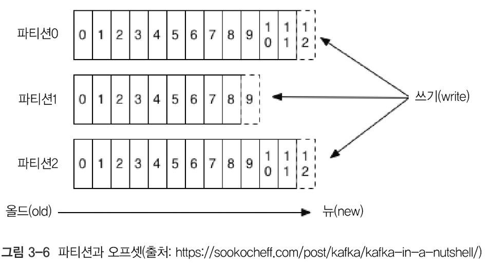
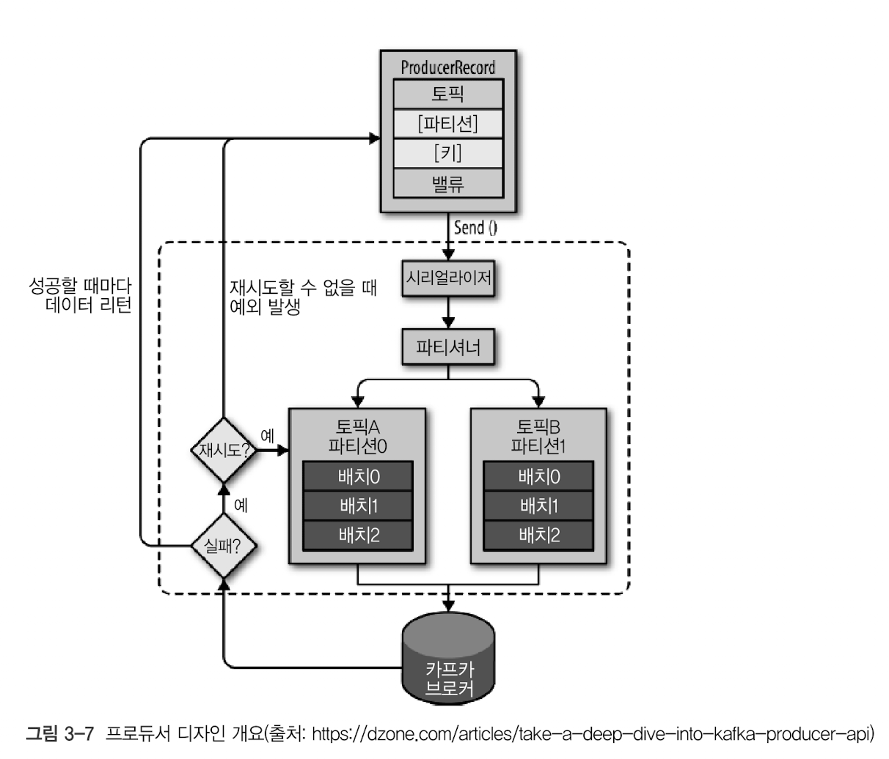

# 3. 카프카 기본 개념과 구조

3장에서는 카프카의 기본 개념과 카프카의 처리량을 높이기 위해 설계된 다음 구조를 다룬다.

- 분산 시스템
- 페이지 캐시
- 배치 전송
- 주키퍼의 역할

## 3.1. 카프카 기초 다지기

카프카를 구성하는 주요 요소

### 카프카 기본 구성 요소

| 구성 요소                                 | 설명                                                                                                                                          |
|---------------------------------------|---------------------------------------------------------------------------------------------------------------------------------------------|
| 주키퍼(ZooKeeper)                        | - 아파치 프로젝트 애플리케이션으로 카프카의 메타데이터(metadata) 관리 및 브로커의 정상상태 점검(health check)을 담당<br/>- Kafka 3.x부터는 KRaft(Kafka Raft)를 지원하여 주키퍼 없이도 운영할 수 있다.   |
| 카프카(Kafka) 또는 카프카 클러스터(Kafka cluster) | - 아파치 프로젝트 애플리케이션으로 여러 대의 브로커를 구성한 클러스터를 의미한다.                                                                                              |
| 브로커(Broker)                           | - 카프카 애플리케이션이 설치된 서버 또는 노드를 의미하며, 프로듀서가 보낸 메시지를 저장하고 컨슈머에게 전달하는 핵심 역할을 한다.<br/>- 하나의 클러스터에는 여러 개의 브로커가 존재할 수 있으며, 각 브로커는 특정 파티션을 저장하고 관리한다. |
| 프로듀서(Producer)                        | - 카프카로 메시지를 보내는 역할을 하는 클라이언트를 총칭한다.                                                                                                         |
| 컨슈머(Consumer)                         | - 카프카에서 메시지를 꺼내는 역할을 하는 클라이언트를 총칭한다.                                                                                                        |
| 토픽(Topic)                             | - 카프카는 메시지 피드들을 토픽으로 구분하고, 각 토픽의 이름은 카프카 내에서 고유하다.                                                                                          |
| 파티션(Partition)                        | - 병렬 처리 및 고성능을 얻기 위해 하나의 토픽을 여러 개로 나눈 것을 말한다.<br/>- 각 파티션은 독립적인 로그 파일로 저장되며, 여러 브로커에 분산되어 저장될 수 있다.                                         |
| 세그먼트(Segment)                         | - 프로듀서가 전송한 실제 메시지가 브로커의 로컬 디스크에 저장되는 파일을 말한다.<br/>- 세그먼트 파일은 일정 크기나 시간 기준으로 롤링(새로운 파일로 교체)되며, 오래된 파일은 삭제될 수 있다.                            |
| 메시지(Message) 또는 레코드(Record)           | - 프로듀서가 브로커로 전송하거나 컨슈머가 읽어가는 데이터 조각을 의미한다.                                                                                                  |

### 3.1.1. 리플리케이션

카프카에서 리플리케이션은 토픽의 파티션을 복제하여 메시지를 여러 브로커에 분산시키는 과정이다. 이를 통해 브로커의 고가용성을 확보할 수 있다.



- 리플리케이션은 토픽 전체가 아닌, 토픽의 파티션을 복제하는 동작을 의미힌다.
- 리플리케이션 팩터(replication factor): 파티션 복제 개수를 나타내며, 토픽 생성 시 설정된다.
- 리플리케이션된 파티션은 리더와 팔로워로 구분된다.
    - 리더는 메시지의 수신(읽기)과 전송(쓰기)을 담당ƒ
    - 팔로워는 리더를 복제하고 장애 대비를 준비한다. (리더의 상태를 확인하고 메시지를 복제)

리플리케이션 펙터 수가 커지면 안정성은 높아지지만, 그만큼 브로커 리소스를 더 많이 사용하게 된다. 따라서 복제에 대한 오버헤드를 줄여서 최대한 브로커를 효율적으로 사용하는 것을 권장한다.

- 테스트/개발 환경: 리플리케이션 펙터 1 (복제 없음)
- 운영 환경
    - 로그성 메시지, 약간의 유실 허용: 펙터 2
    - 유실 불허: 펙터 3

팩터를 3으로 설정하더라도 충분히 안정적으로 메세지 유실 없이 운영할 수 있다. 4 이상으로 펙터 수를 설정하면 불필요한 디스크 공간을 차지하게 되어 효율성이 떨어진다.

### 3.1.2. 파티션

하나의 토픽을 병렬로 처리하여 처리량을 높이기 위해 하나의 토픽엔 여러 파티션으로 구성한다.



- 파티션 번호는 0부터 시작된다.
- 토픽을 생성할 때 `파티션 수`를 설정한다.
- **[중요]** 파티션 증가는 가능하지만 절대 감소 불가하다.
    - 이유: 파티션 삭제 시 메시지 순서 보장 어려움

**파티션 수 설정 가이드**

1. 초기 설정시 파티션 수는 작게 설정한다. (예: 3~6)
2. `컨슈머의 LAG`을 모니터링하면서 필요할 때 조금씩 늘려간다.

> 컨슈머 LAG = 프로듀서가 전송한 최신 오프셋 - 컨슈머가 처리한 오프셋

**파티션 확장이 필요한 조건**

- 컨슈머 LAG 증가 시
- 처리량이 파티션 수를 초과할 때
- 컨슈머 그룹 확장 필요 시

**파티션 관련 주의사항**

- 파티션 1개 증가 = 최대 1개의 컨슈머 추가 가능
    - 카프카에서 하나의 파티션은 동시에 오직 하나의 컨슈머에 의해서만 처리될 수 있다.
    - 파티션 수가 증가하면, 그에 따라 병렬로 처리할 수 있는 컨슈머의 수도 증가할 수 있다.
    - 따라서 파티션을 1개 추가하면, 이론적으로 최대 1개의 추가 컨슈머가 동시에 데이터를 처리할 수 있게 된다.
- 즉 과도한 파티션은 브로커 부하 ↑

### 3.1.3. 세그먼트

세그먼트(Segment) 란, 카프카 브로커가 토픽의 파티션에 저장한 메시지를 로그 파일 형태로 보관하는 단위다.



즉, 메시지는 하나의 파일이 아니라 여러 개의 세그먼트 파일로 분할 저장되며, 특정 조건(크기 또는 시간)이 충족되면 새로운 세그먼트가 생성(롤링)된다.

> 세그먼트는 로그 파일 형태로 브로커의 로컬 디스크에 저장된다.

### 3.1.3.1. 메시지가 저장되는 과정



1. 프로듀서가 메시지를 생성하고 특정 토픽에 전송한다.
2. 전송된 메시지는 카프카로 전송되고, 카프카는 내부의 브로커로 전달한다.
3. 브로커는 토픽의 특정 파티션에 전송된 메시지를 저장한다.
    - 토픽에는 여러 개의 파티션이 존재하며, 메시지는 특정 파티션으로 분배된다.
4. 파티션은 전달받은 메시지를 `세그먼트` 라는 로그 파일 형태로 저장한다.

> 메시지 흐름: 프로듀서 → 카프카 클러스터 → 브로커 → 토픽 → 파티션 → 세그먼트

### 3.1.3.2. 세그먼트의 동작 방식 (세그먼트 롤링)

- **세그먼트 파일은 특정 크기(기본 1GB) 또는 시간(기본 1주일) 기준으로 새로운 파일로 "롤링"됨.**
- 현재 메시지가 기록 중인 세그먼트를 "**액티브 세그먼트(Active Segment)**" 라고 부른다.
- 일정 조건이 충족되면 **새로운 세그먼트가 생성되며, 이전 세그먼트는 읽기 전용(read-only)으로 변경됨.**

> **롤링 조건:** <br/>
> - `log.segment.bytes`: **세그먼트 파일 크기가 설정된 값(기본 1GB)을 초과할 때 롤링 발생**
> - `log.roll.ms`: **설정된 시간(기본 1주일)이 지나면 롤링 발생**

### 3.1.3.3. 세그먼트의 구성 요소

세그먼트는 **두 가지 주요 파일로 구성됨:**

| 파일명             | 설명                            |
|-----------------|-------------------------------|
| **`.log` 파일**   | 실제 메시지 데이터를 저장                |
| **`.index` 파일** | 메시지의 오프셋을 빠르게 찾기 위한 인덱스 정보 저장 |

> 인덱스 파일 역할: `.index` 파일은 **각 메시지의 오프셋과 로그 파일의 위치를 저장**한다. 이를 통해 특정 메시지를 **빠르게 검색 가능**하다.

- **효율적인 디스크 관리** → 메시지를 작은 단위로 분할 저장하여 디스크 공간을 최적화
- **빠른 메시지 검색** → 인덱스 파일을 통해 특정 오프셋의 메시지를 빠르게 찾을 수 있음
- **오래된 데이터의 쉬운 삭제** → **세그먼트 단위로 삭제**하여 불필요한 메시지를 효과적으로 관리 가능

### 3.1.3.4. 파티션과 세그먼트의 관계

- 각 파티션은 여러 개의 세그먼트로 구성됨.
- 카프카의 메시지 저장 및 삭제 단위는 **파티션이 아니라 세그먼트 단위**로 이루어짐.
- 컨슈머가 특정 메시지를 가져올 때, **인덱스 파일을 활용해 빠르게 검색 가능.**

## 3.2. 카프카의 핵심 개념

이번 절에선 카프카가 높은 처리량과 안정성을 지니게 된 특성들을 하나씩 살펴보자.

- [3.2.1. 분산 시스템](#321-분산-시스템)
- [3.2.2. 페이지 캐시](#322-페이지-캐시)
- [3.2.3. 배치 전송 처리](#323-배치-전송-처리)
- [3.2.4. 압축 전송](#324-압축-전송)
- [3.2.5 토픽, 파티션, 오프셋](#325-토픽-파티션-오프셋)
- [3.2.6 고가용성 보장](#326-고가용성-보장)
- [3.2.7 주키퍼의 의존성](#327-주키퍼의-의존성)

### 3.2.1. 분산 시스템

분산 시스템은 네트워크상에서 연결된 컴퓨터들의 그룹을 의미하며, 다음과 같은 특징을 가진다.

- 높은 성능: 단일 시스템보다 더 높은 성능을 목표로 한다.
- 고가용성: 특정 노드에 장애가 발생해도 다른 노드가 처리를 이어갈 수 있다.
- 트래픽 분산: 부하를 여러 노드에 분산해 처리 성능을 향상시킨다.
- 확장성: 카프카의 경우 브로커를 추가하여 스케일 아웃할 수 있다.

다만, 브로커 추가만으로 스케일 아웃이 완전히 해결되는 것은 아니다.

- **프로듀서의 메시지 순서 이슈**: 파티션 개수가 변하면 프로듀서의 메시지 라우팅 방식에 영향을 미쳐, 메시지 순서가 깨질 가능성이 있다.
    - → 파티션 개수가 변경되면 프로듀서가 동일한 파티션에 메시지를 보내지 않게 되어, 메시지 순서 보장이 어려워질 수 있다.
- **컨슈머 부하 이슈**: 컨슈머 그룹의 확장이 이루어지지 않으면, 일부 컨슈머에 부하가 집중되어 전체 성능에 영향을 미칠 수 있다.
    - 컨슈머 수도 함께 확장되지 않으면 부하가 특정 컨슈머에 집중될 수 있고, 다른 컨슈머는 유휴 상태가 될 수 있다.
- **컨슈머 리밸런스 이슈**: 브로커 확장 시 리밸런스가 발생하여, 이때 컨슈머가 파티션을 재할당 받기 때문에 일시적인 성능 저하가 있을 수 있다. 따라서 안정적인 파티션 개수 유지 전략이 필요하다.

### 3.2.2. 페이지 캐시

빠른 읽기 성능을 확보하려면 디스크 I/O를 최소화하고, 메모리를 최대한 활용하는 것이 중요하다.

카프카 -> 페이지 캐시 -> 디스크

카프카는 OS의 페이지 캐시(page cache)를 활용하여 디스크 접근을 줄이고 성능을 향상시킨다. 페이지 캐시는 애플리케이션이 사용하지 않는 물리 메모리를 캐시로 활용하여, 디스크에서 직접 데이터를 읽는 대신
메모리에서 빠르게 처리할 수 있도록 돕는다.

이를 통해 카프카는 높은 처리량을 유지하면서도 빠른 데이터 읽기/쓰기 성능을 제공한다.

### 3.2.3. 배치 전송 처리

카프카는 `배치 메시지 전송`을 활용하여, 여러 메시지를 하나의 배치로 묶어 전송하는 방식으로 데이터를 처리한다.

배치 전송은 비동기 방식으로 수행될 때 효율이 극대화되며, 이는 `네트워크 오버헤드`를 줄이고, 다량의 데이터를 더 빠르고 효율적으로 처리할 수 있게 한다. 예를 들어, 여러 메시지를 개별적으로 전송하는 대신 배치
전송으로 묶어 보내면 전송 횟수를 줄여 통신 비용을 절감할 수 있다.

실시간 처리보다는 비실시간 데이터 처리에 더 적합하며, 대량의 로그 데이터와 같은 비실시간 데이터를 배치로 묶어 처리할 때 성능을 향상시킬 수 있다.

> 네트워크 오버헤드는 데이터를 전송할 때 발생하는 추가적인 비용이나 자원 소모를 의미한다. 이는 실제 데이터 전송 외에도 필요한 부가 작업들(예: 패킷 헤더, 연결 설정 등)로 인해 발생하며, 네트워크 성능에
> 영향을 미친다. 데이터를 효율적으로 전송하기 위해서는 이 오버헤드를 최소화하는 것이 중요한 최적화 목표 중 하나다.

### 3.2.4. 압축 전송

카프카는 메시지 전송 효율을 높이기 위해 압축 전송을 권장한다.

적절한 압축 방식 선택은 **전송 속도**와 **저장 공간 절약**에 중요한 영향을 미친다.

- 높은 압축률
    - gzip, zstd
- 빠른 응답 속도
    - lz4, snappy

압축 방식에 따라 성능 차이가 나므로, 실제 환경에서 각 압축 타입별로 테스트 후 최적의 방식을 선택하는 것이 가장 좋다.

### 3.2.5 토픽, 파티션, 오프셋

카프카의 브로커는 데이터를 **토픽(topic)**이라는 단위로 저장한다.



- 토픽은 여러 개의 **파티션(partition)**으로 나뉘어 병렬 처리된다.
- **오프셋(offset)**은 각 파티션에서 컨슈머가 마지막으로 읽은 메시지의 위치를 나타낸다.
    - 오프셋은 각 파티션마다 독립적으로 관리된다.
    - 오프셋을 통해 메시지 순서를 보장할 수 있다.
    - 오프셋은 고유의 숫자 값으로 증가하며, 이를 통해 메시지의 순서와 위치를 추적할 수 있다.

### 3.2.6 고가용성 보장

카프카는 [분산 시스템](#321-분산-시스템) 특성을 활용해 단일 노드 장애 시에도 안정적인 서비스를 보장한다.

#### 3.2.6.1 파티션 단위 리플리케이션

고가용성을 보장하기 위해 **파티션 단위 리플리케이션**과 **리더-팔로워 구조**를 활용한다.

> 카프카의 리플리케이션 기능은 토픽이 아닌 **토픽의 파티션을 복제**하는 방식으로 동작한다. 이는 브로커가 메시지를 저장하는 최소 단위가 **파티션**이기 때문이다.

#### 리더와 팔로워

- **리더(Leader)**: 모든 읽기/쓰기 요청을 처리한다.
- **팔로워(Follower)**: 리더의 데이터를 복제하는 역할만 수행한다. (쓰기 및 읽기 요청을 처리하지 않음)
- **ISR(In-Sync Replicas)**: 동기화된 레플리카 그룹

#### 리더와 팔로워 구성 예시

| 브로커 | 파티션 0 | 파티션 1 |
|--------|---------|---------|
| A      | 리더    | 팔로워  |
| B      | 팔로워  | 리더    |
| C      | 팔로워  | 팔로워  |

> **팔로워가 직접 읽기 요청을 처리하지 않는 이유** <br/>
> - **일관성 보장**: 리더만 쓰기 처리 → 모든 레플리카의 메시지 순서 통일 <br/>
> - **성능 최적화**: 복제 과정 단순화를 통한 처리량 극대화 <br/>
> - **ISR 동기화**: 팔로워의 데이터 일치 여부 확인 후 리더 승격 가능

#### 3.2.6.2 리플리케이션 팩터(Replication Factor)

리플리케이션 팩터는 **파티션을 몇 개의 복제본으로 유지할지 결정하는 값**이다.

#### 리플리케이션 팩터 계산

```text
팩터 수 2 → 리더 1개 + 팔로워 1개
팩터 수 3 → 리더 1개 + 팔로워 2개
팩터 수 4 → 리더 1개 + 팔로워 3개
```

#### 장점과 단점

| 장점              | 단점                 |
|-----------------|------------------|
| 장애 허용력 증가   | 디스크 사용량 증가      |
| 데이터 안전성 증가 | 복제 지연 가능성 증가   |
| 읽기 확장성 증가   | 브로커 간 네트워크 트래픽 증가 |

> 리플리케이션 팩터가 높을수록 장애 발생 시 데이터 보호 수준이 올라가지만, 디스크 사용량이 증가하고 복제 오버헤드가 커진다. 일반적으로 **리플리케이션 팩터 3을 권장**한다.

#### 3.2.6.3 장애 발생 시 리더 승격 프로세스

1. **장애 감지**: 주키퍼 세션 타임아웃 (기본 6초)
2. **ISR 확인**: 동기화된 팔로워(B, C) 중에서 후보 선정
3. **컨트롤러 선출**: 주키퍼가 컨트롤러 브로커 지정
4. **새 리더 선출**:

```text
- 파티션 0: B 또는 C 중 가장 높은 LEO(Log End Offset) 보유자가 리더로 승격
- 파티션 1: 동일한 기준 적용
```

#### 설정 옵션 예시

```text
unclean.leader.election.enable=false  # 서비스 중단 (데이터 무결성 우선)
unclean.leader.election.enable=true   # 데이터 손실 가능성 있지만 서비스 재개
```

> `unclean.leader.election.enable=true` 설정 시, 모든 ISR이 다운되더라도 서비스가 지속되지만 데이터 손실 위험이 있다.

#### 3.2.6.4 고가용성 시나리오 예시

1. **리플리케이션 팩터 3 (리더 1 + 팔로워 2)**
  - 리더 장애 발생 → 팔로워 중 1개가 즉시 리더로 승격
  - 남은 팔로워 1개로 계속 복제 유지
2. **모든 레플리카 장애 시 대응 방식**
  - `unclean.leader.election.enable=false` → 서비스 중단 (데이터 보호 우선)
  - `unclean.leader.election.enable=true` → 데이터 손실 가능성이 있지만 서비스 지속 가능

### 3.2.7 주키퍼의 의존성

주키퍼(ZooKeeper)는 분산 애플리케이션에서 **코디네이터 역할**을 수행하는 애플리케이션이다.

주키퍼는 여러 대의 서버를 **앙상블(Ensemble)** 형태로 구성하며, 살아 있는 노드 수가 **과반수 이상 유지**되면 지속적인 서비스 운영이 가능하다.

#### 주키퍼의 주요 특징

- **홀수 개의 노드**로 구성해야 한다.
- **리더 선출 및 메타데이터 관리**를 담당한다.
- 카프카의 브로커 상태를 모니터링하고 조정한다.

#### KRaft

- **지원 종료 일정**:
  - `3.5.x` (2022): 주키퍼 모드 deprecated
  - `3.6.x` (2023): KRaft 모드 GA(General Availability)
  - `4.0` (2024 예정): KRaft 전용 모드 (주키퍼 지원 완전 중단)

- **현실적 적용**:
  - 기존 주키퍼 기반 클러스터는 여전히 운영 가능
  - 신규 구성 시 KRaft 모드 권장

### 3.3. 프로듀서의 기본 동작과 예제 맛보기



카프카 프로듀서(Producer)는 데이터를 토픽으로 전송하는 역할을 담당하며, 메시지를 생성하고 이를 브로커로 전달하는 과정을 수행한다.

#### 3.3.1 ProducerRecord 구조
프로듀서가 카프카로 메시지를 전송할 때 사용하는 객체가 `ProducerRecord`이다. 주요 구성 요소는 다음과 같다.

- **토픽(필수)**: 메시지를 전송할 카프카 토픽
- **밸류(필수)**: 실제 메시지 값
- **파티션(선택)**: 특정 파티션을 지정하여 메시지 전송 가능
- **키(선택)**: 같은 키 값을 가진 메시지는 동일한 파티션으로 전송됨 (파티셔너가 결정)

#### 3.3.2 메시지 전송 과정
1. 프로듀서는 `send()` 메서드를 호출하여 메시지를 전송한다.
2. 메시지는 **시리얼라이저(Serializer)**와 **파티셔너(Partitioner)**를 거쳐 브로커로 전송된다.
  - 특정 파티션이 지정되었다면, 파티셔너를 거치지 않고 바로 해당 파티션으로 전송된다.
3. 메시지는 프로듀서 내부에서 **배치(Buffer)** 형태로 잠시 모아뒀다가 한 번에 전송된다.
4. 전송 실패 시 자동으로 재시도하며, **설정된 최대 재시도 횟수**를 초과하면 최종적으로 실패로 간주된다.
5. 메시지 전송 성공 시 브로커로부터 **메타데이터(토픽, 파티션, 오프셋 정보)**를 반환받는다.

이와 같은 과정을 통해 카프카 프로듀서는 높은 성능과 안정성을 유지하면서 메시지를 효율적으로 전송할 수 있다.

## 3.4. 컨슈머의 기본 동작과 예제 맛보기

컨슈머는 메시지만 가져오는 것 같지만, 내부적으로 컨슈머 그룹, 리밸런싱 등 여러 동작을 수행한다.

프로듀서가 아무리 빠르게 메시지를 전송하더라도, 컨슈머가 카프카로부터 빠르게 메시지를 읽어오지 못한다면 결국 지연이 발생한다.

### 3.4.1. 컨슈머 기본 동작

프로듀서가 카프카의 **토픽(Topic)**으로 메시지를 전송하면, 해당 메시지는 **브로커(Broker)**의 로컬 디스크에 저장된다. 컨슈머는 이를 가져와 처리하는 역할을 한다.

**컨슈머 그룹(Consumer Group) 개념**
- 컨슈머 그룹: 하나 이상의 컨슈머가 모여서 동작하는 그룹
- 컨슈머는 반드시 하나의 컨슈머 그룹에 속해야 한다.
- 컨슈머 그룹 단위로 메시지를 구독하며, 그룹 내 컨슈머들이 파티션을 나눠 처리한다.

**컨슈머와 파티션 매핑**
- 컨슈머 그룹의 컨슈머들은 각 파티션의 리더에게 메시지를 요청하여 가져온다.
- 이상적인 상태는 파티션 수 = 컨슈머 수인 경우이며, 이때 각 컨슈머가 하나의 파티션을 담당한다.
- 파티션은 단 하나의 컨슈머에게만 할당될 수 있다. 
  - 즉, 컨슈머 수가 파티션 수보다 많으면, 남는 컨슈머는 유휴 상태가 된다. 
  - 반대로 컨슈머 수가 파티션 수보다 적다면, 하나의 컨슈머가 여러 개의 파티션을 담당해야 한다.

**장애 발생 시 리밸런싱(Rebalancing)**
- 컨슈머 그룹은 액티브/스탠바이 구조가 아니다.
- 특정 컨슈머가 장애로 인해 중단되면, 리밸런싱을 통해 나머지 컨슈머가 자동으로 해당 파티션을 가져간다.
- 즉, 장애 대비를 위해 미리 유휴 컨슈머를 할당할 필요가 없다.

## 3.5. 정리

지금 까지 카프카의 기본적인 구성과 디자인을 설명 했다.
