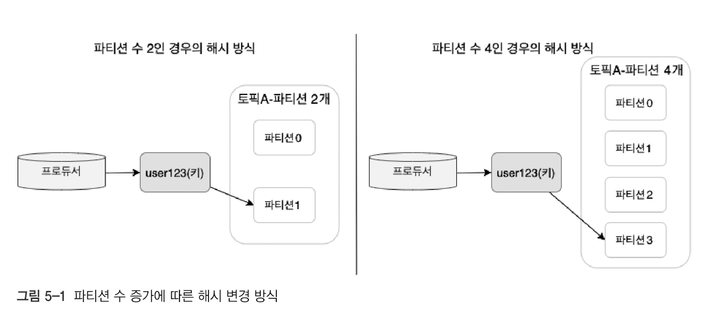
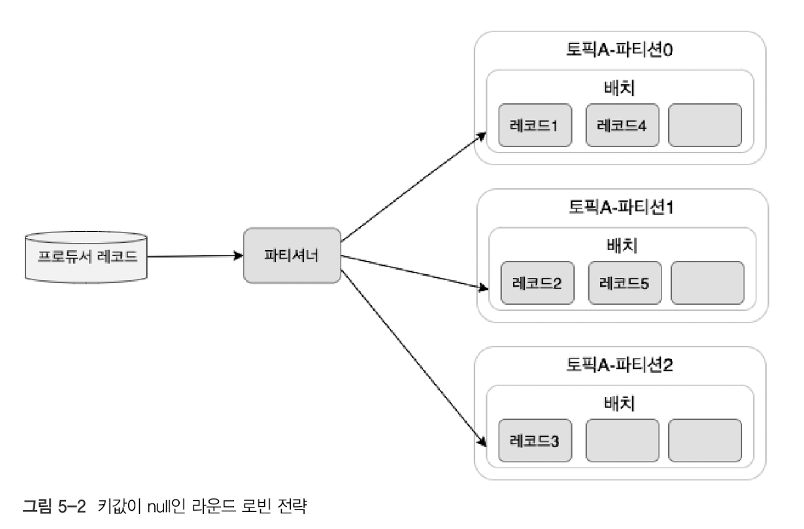
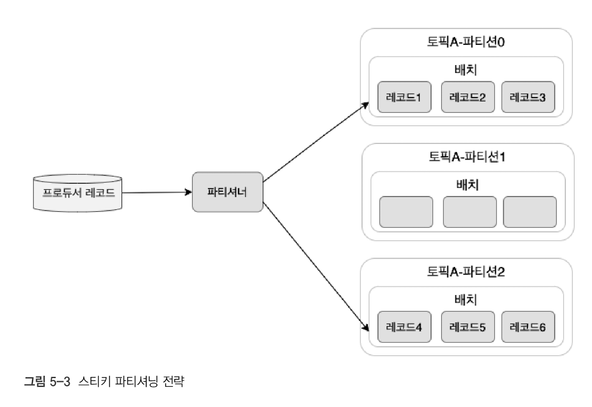

# 5. 프로듀서의 내부 동작 원리와 구현

- [파티셔너](#51-파티셔너)
- [프로듀서의 배치](#52-프로듀서의-배치)
- [중복 없는 전송](#53-중복-없는-전송)
- [정확히 한 번 전송](#54-정확히-한-번-전송)

## 5.1. 파티셔너

파티셔너는 프로듀서가 토픽으로 전송한 메시지를 토픽의 어느 파티션으로 메시지를 보내야할지 결정하는 역할을 한다.

> 토픽은 병렬 처리가 가능하도록 토픽 내부에 파티션을 나누고 최소 하나 또는 둘 이상의 파티션으로 구성된다. 프로듀서가 카프카로 전송한 메시지는 해당 토픽 내 각 파티션의 **로그 세그먼트**에 저장된다.

### 5.1.1. 파티션 분배 전략

- 해시
- 라운드 로빈
- 스티키 파티셔닝 전략

| 전략                     | 순서 보장 여부 | 메시지 배치 방식                          | 특징 |
|--------------------------|--------------|---------------------------------|----------------------------|
| **해시 할당 (Key 기반)** | ✅ (파티션 수 고정 시) / ❌ (파티션 증가 시) | 같은 Key의 메시지가 동일한 파티션에 할당됨 | 파티션 개수가 증가하면 Key의 해시값에 따라 파티션이 변경될 수 있어 순서가 깨질 수 있음 |
| **라운드 로빈**         | ❌ 보장 안됨 | 파티션을 순차적으로 선택하여 분배 | 파티션 개수가 증가하면 새로운 파티션에 메시지가 분배되므로 순서가 보장되지 않음 |
| **스티키 파티셔닝**      | ❌ 보장 안됨 | 한 번 선택한 파티션에 가능한 많은 배치를 보냄 | 배치를 최적화하여 성능을 향상시키지만 순서는 보장되지 않음 |

### 5.1.1.1. 해시 전략

**메시지(레코드)에 키가 존재할 경우**, 프로듀서가 파티션을 결정하는 알고리즘은 기본적으로 해시 기반 방식으로 동작된다.

해시 기반은 메시지(레코드)의 키를 해시(hash) 처리해 파티션을 구하는 방식으로 메시지의 키 값이 동일하다면, 해당 메시지들은 모두 같은 파티션으로 전송된다.

그러나 파티션 수가 변경되면 기존의 키-파티션 매핑도 변경될 수 있다.

카프카는 클라이언트의 처리량을 높이기 위해 토픽의 파티션을 확장할 수 있는 기능을 제공한다. 이때 파티션 수가 변경됨과 동시에, 메시지의 키와 매핑된 해시 테이블도 변경된다.

즉, 프로듀서가 동일한 키를 가진 메시지를 전송하더라도, 파티션 개수가 변경되면 해당 키가 새로운 파티션에 매핑될 가능성이 있다. 이로 인해 키를 기준으로 한 메시지의 순서가 보장되지 않을 수 있으므로, 파티션 수
변경 시 주의가 필요하다.

### 5.1.1.2. 라운드 로빈 전략

**메시지(레코드)에 키가 없는 경우**, 프로듀서는 라운드 로빈 알고리즘을 사용해 메시지를 목적지 토픽의 파티션들로 균등하게 분배한다.

> 프로듀서가 메시지를 전송할 때 레코드의 키는 필수 항목이 아니므로, 관리자는 별도의 키 값을 지정하지 않고 메시지를 전송할 수 있다.

파티셔너를 거친 후, 레코드들은 배치 처리를 위해 `프로듀서의 버퍼 메모리 영역`에 잠시 대기한 후 카프카로 전송된다.

1. 각 파티션별로 배치 전송을 위해 필요한 레코드 수는 3으로 설정됐다.
2. 프로듀서는 메시지 생성한다.
3. 생성된 메시지는 파티셔너로 전달한다.
4. 파티셔너는 `라운드 로빈 방식`으로 메시지를 파티션에 할당한다
    - `레코드1` -> `파티션0`
    - `레코드2` -> `파티션1`
    - `레코드3` -> `파티션2`
    - `레코드4` -> `파티션0`
    - 프로듀서 레코드가 파티셔너에 전송되면 위 레코드 할당 과정은 반복한다.
5. 메시지는 `프로듀서의 버퍼 메모리`에 대기하며, 최소 배치 크기가 모일 때까지 기다린 후 카프카로 전송된다.

라운드 로빈 전략은 메시지 분배를 균등하게 하여 `메시지의 분배 효율성`을 높이지만, 배치 처리가 지연될 경우 대기 시간이 길어져 성능에 영향을 미칠 수 있다.

### 5.1.1.3. 스티키 파티셔닝 전략

스티키 파티셔닝 전략은 라운드 로빈 전략에서 배치 전송 지연 시간이 불필요하게 증가되는 비효율적인 전송을 개선하고자 2019년 출시된 아파치 카프카 2.4 부터 지원하는 전략이다.

하나의 파티션에 레코드 수를 먼저 채워서 카프카로 빠르게 배치 전송하는 전략을 말한다.

1. 각 파티션별로 배치 전송을 위해 필요한 레코드 수는 3으로 설정됐다.
2. 프로듀서는 메시지 생성한다.
3. 생성된 메시지는 파티셔너로 전달한다.
4. 파티셔너는 `스티키 파티셔닝 방식`으로 메시지를 파티션에 할당한다
   - [`레코드1` -> `파티션0`]
   - [`레코드2` -> `파티션0`]
   - [`레코드3` -> `파티션0`] → 전송 완료 ✅
   - [`레코드4` -> `파티션1`]
   - [`레코드5` -> `파티션1`]
   - [`레코드6` -> `파티션1`] → 전송 완료 ✅
   - 프로듀서 레코드가 파티셔너에 전송되면, 파티셔너는 배치를 위한 레코드 수에 도달할 때까지 다른 파티션으로 보내지 않고, 동일한 파티션에 레코드를 할당하는 과정을 반복한다.
5. 메시지는 `프로듀서의 버퍼 메모리`에 대기하며, 최소 배치 크기가 모일 때까지 기다린 후 카프카로 전송된다.

기본 설정에 비해 약 30% 이상 지연시간이 감소하고 프로듀서의 CPU 사용률도 줄어드는 효과를 얻을 수 있다.
카프카로 전송하는 메시지의 순서가 그다지 중요하지 않은 경우리마녀 스티키 파티셔닝 전략을 적용하기를 권장한다.

> 컨슈머는 파티션 단위로 데이터를 읽기 때문에, 동일한 파티션 내부에서는 순서가 보장되지만, 다른 파티션끼리는 순서가 바뀔 수 있다. (오프셋은 각 파티션별로 관리하기 때문)

## 5.2. 프로듀서의 배치

## 5.3. 중복 없는 전송

## 5.4. 정확히 한 번 전송
