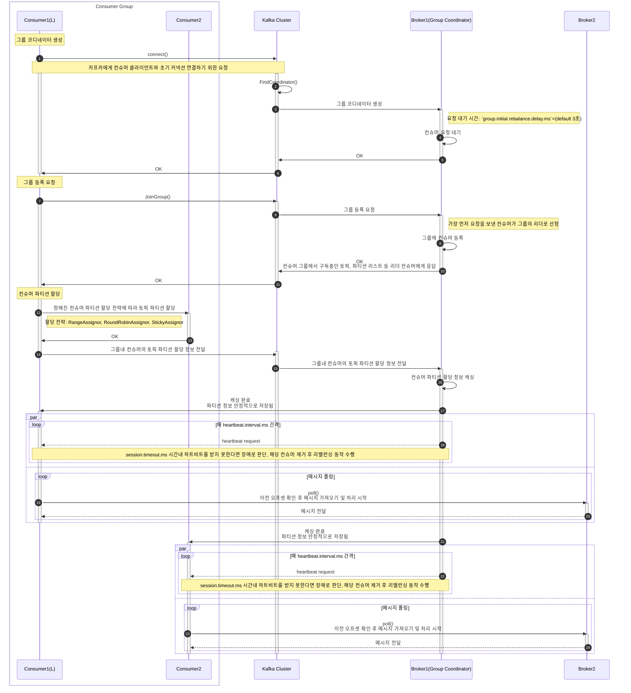
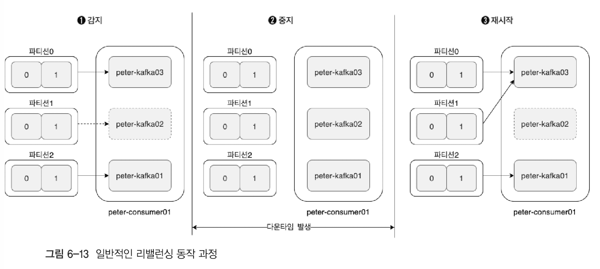
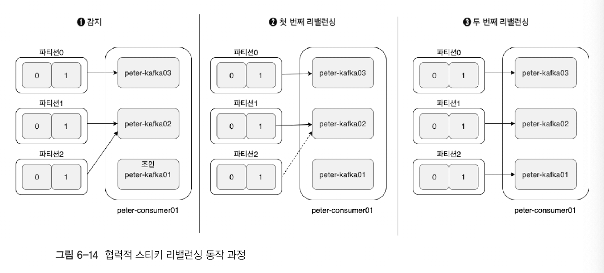

# 6. 컨슈머의 내부 동작 원리와 구현

- 컨슈머 그룹
- 오프셋 관리
- 컨슈머들의 파티션 할당 정책
- 정확히 한 번 전송 트랜잭션 컨슈머의 내부 동작

## 6.1. 컨슈머 오프셋 관리

컨슈머의 동작 중 가장 핵심은 바로 오프셋 관리다.

오프셋은 메시지의 위치를 의미하며, 오프셋 정보는 `__consumer_offsets` 내부 토픽에서 각 컨슈머 그룹 별로 오프셋 위치 정보를 독립적으로 관리한다.

- 오프셋 내부 토픽은 브로커 설정을 참고하자.
    - [`offsets.topic.num.partitions`](https://kafka.apache.org/documentation/#brokerconfigs_offsets.topic.num.partitions):
      파티션 수, default 50
    - [`offsets.topic.replication.factor`](https://kafka.apache.org/documentation/#brokerconfigs_offsets.topic.replication.factor):
      리플리케이션 팩터 수, default 3

````text
[  A  B  C  D  E  ]
  0  1  2  3  4  5

1. Consumer consume(C)
2. __consumer_offsets [offset=3] 
````

1. 컨슈머들은 메시지를 읽는다.
2. 컨슈머 그룹은 각 메시지의 오프셋 정보를 오프셋 토픽에 저장한다.
    - 이때, 컨슈머 그룹은 컨슈머 그룹, 토픽, 파티션등의 내용을 통합해 기록한다.
    - 오프셋 토픽의 오프셋 값은 컨슈머가 읽은 메시지의 위치가 아니다.
    - 컨슈머가 다음으로 읽어야할 위치(ex. DB의 레코드 커서)를 뜻한다.
3. 컨슈머의 변경이 있는 경우(컨슈머 장애 또는 컨슈머 이탈)에 컨슈머 그룹은 오프셋 토픽을 활용해 해당 컨슈머가 메시지를 어디까지 읽었는지 추적할 수 있다.

## 6.2. 그룹 코디네이터

하나의 컨슈머 그룹엔 여러 컨슈머로 구성돼 있고, "그룹 코디네이터"는 안정적인 컨슈머 그룹 관리를 돕는다.

> 참고로 카프카에서 코디네이터는 브로커에 속하며, 각 코디네이터별 관리 주체가 다르다. 마찬가지로 그룹 코디네이터도 특정 브로커에 속한다.

### 6.2.1. 컨슈머의 어떤 동작을 돕나요?

- 각 컨슈머들은 자신의 정보를 공유하면서 하나의 공동체로 동작한다.
- 그룹 내의 컨슈머들은 언제든 그룹에서 제외될 수 있으며, 새로운 컨슈머가 투입될 수 있다.
- 그룹 내 컨슈머들이 메시지 균등하게 처리하는 동작을 컨슈머 리밸런싱(consumer rebalancing)이라 한다.
    - '컨슈머 리밸런싱이 일어났다'라고 표현하기도 한다.

### 6.2.2. 그룹 코디네이터의 목적

그룹 코디네이터의 목적은 크게 두 가지다.

- 토픽 파티션 트래킹(tracking)
    - 컨슈머 그룹이 구독한 토픽의 파티션들과 그룹의 멤버들을 트래킹하기 위함
- 컨슈머 리밸런싱
    - 그룹의 멤버 변화로 인한 `컨슈머 리밸런싱`(작업 재분배) 동작 지원

### 6.2.2. 그룹 코디네이터의 동작 방식



1. 컨슈머 그룹이 카프카 클러스터에 최초 연결 요청
2. 클러스터는 브로커 중 하나에 그룹 코디네이터를 생성
3. 매핑된 그룹 코디네이터는 컨슈머 그룹의 멤버 변경 감지 및 알림, 리밸런싱 동작 지원
4. 코디네이터에게 컨슈머는 join 또는 leave 요청하여 언제든 그룹에서 포함되거나 제외될 수 있다.
5. 코디네이터는 주기적으로 컨슈머에게 하트비트 요청을 통해 변경 감지
    - [`heartbeat.interval.ms`](https://kafka.apache.org/documentation/#consumerconfigs_heartbeat.interval.ms): 하트비트 인터벌
      시간(default 3초)
    - [`session.timeout.ms`](https://kafka.apache.org/documentation/#consumerconfigs_session.timeout.ms): 하트비트 응답 대기 시간(
      default 45초), 응답 시간내 컨슈머 요청이 없다면 장애로 판단 후 제거되고 리밸런싱 동작 수행.
    - [`max.poll.interval.ms`](https://kafka.apache.org/documentation/#consumerconfigs_max.poll.interval.ms): 메시지 폴링 최대
      간격 시간 (default 5분). 컨슈머는 주기적으로 메시지를 폴링해야 하며, poll() 호출 이후 최대 5분간 호출되지 않으면 비정상으로 간주되어 리밸런싱이 발생함.

> 리밸런싱 동작은 높은 비용이 지출되므로 가급적 리밸런싱이 자주 발생하지 않도록 주의해야 한다.

## 6.3. 스태틱 멤버십

컨슈머의 불필요한 리밸런싱을 줄이기 위해, 카프카 2.3+ 부터 스태틱 멤버십 기능이 도입됐다.

- [group.instance.id](https://kafka.apache.org/documentation/#consumerconfigs_group.instance.id)
    - 각 컨슈머에게 고유한 ID를 지정하여, 재시작 시에도 동일한 멤버로 인식되게 함.
    - ex. consumer-`${HOSTNAME}`-`${PROCESS_ID}`
- [session.timeout.ms](https://kafka.apache.org/documentation/#consumerconfigs_session.timeout.ms)
    - 스태틱 멤버십 사용 시 기본값(45초) 보다 더 큰 값으로 재설정 필요
    - session.timeout.ms ≥ 예상 최대 재시작 시간 + 10% 여유
    - ex. 재시작 2분 → session.timeout.ms=132000 (2분 12초)

### 6.3.1. 컨슈머 리밸런싱은 언제 되나?

1. 그룹 내 컨슈머는 임시적으로 엔티티 ID 식별자를 부여됨
2. 컨슈머 설정 변경이나 업데이트로 인해 재시작 발생.
3. 재시작된 컨슈머가 나갔다가 다시 그룹에 다시 합류됨
    - 총 두 번 리밸런싱 발생!!
4. 이전과 동일한 컨슈머임에도 새로운 엔티티 ID가 부여됨
5. 그룹 코디네이터는 이를 새 멤버로 간주하여 리밸런싱 발생
6. 리밸런싱으로 인해 그룹 내 전체 컨슈머 대상으로 파티션이 재할당 발생.

### 6.3.2. 운영 환경에서의 활용

운영 중 하드웨어 점검이나 소프트웨어 업데이트로 인해 컨슈머를 순차적으로 재시작해야 할 경우, 스태틱 멤버십이 매우 유용하다.
컨슈머마다 고정된 인스턴스 ID를 설정하면, 그룹 코디네이터가 이를 기존 멤버로 인식하고 리밸런싱 없이 그룹에 재합류시킨다.

## 6.4. 컨슈머 파티션 할당 전략

컨슈머 그룹 내에서 파티션을 어떻게 할당할지 결정하는 전략을 소개한다.

- [`partition.assignment.strategy`](https://kafka.apache.org/documentation/#consumerconfigs_partition.assignment.strategy)
    - 기본 값: "[RangeAssignor, CooperativeStickyAssignor]"
    - 목적: 컨슈머 간 부하 분산, 리밸런싱 효율성, 메시지 순서 보장 등을 최적화.
    - 동작 시점: 컨슈머 그룹 가입/탈퇴, 브로커 장애 등 리밸런싱이 발생할 때 적용.
    - **[권장]** 신규 버전에서는 `CooperativeStickyAssignor`로 점진적 전환을 권장함.
    - 커스텀 전략: `ConsumerPartitionAssignor` 인터페이스 구현 후 클래스명 지정 가능.

| 전략 (Class Name)           | 동작 방식                                                                                          | 특징                        | 사용 사례       |
|---------------------------|------------------------------------------------------------------------------------------------|---------------------------|-------------|
| RangeAssignor             | 토픽별로 파티션을 균등 분할<br/>예: P0~P3 → C1: P0-1, C2: P2-3                                              | 간단하지만 토픽 간 불균형 발생 가능      | 단순한 워크로드    |
| RoundRobinAssignor        | 모든 파티션을 라운드로빈으로 할당<br/>예: P0→C1, P1→C2, P2→C1                                                  | 균등 분배 but 리밸런싱 시 재할당 비용 큼 | 고르는 분배 필요 시 |
| StickyAssignor            | 기존 컨슈머에 할당된 파티션을 최대한 유지하며 재조정                                                                  | 리밸런싱 시 파티션 이동 최소화         | 빈번한 리밸런싱 방지 |
| CooperativeStickyAssignor | StickyAssignor 와 동일한 로직을 따르되,<br/>Cooperative Rebalancing(점진적 재조정)을 지원해 리밸런싱 중에도 서비스 중단 최소화 가능 | 다운타임 감소, 롤링 업그레이드 지원      | 운영 환경 최적화   |

- 단순한 워크로드, 토픽 수가 적은 환경 → `RangeAssignor`
    - 토픽 간 불균형 발생 가능(특히 파티션 수가 적을 때)
    - 멀티 토픽 처리 → `RangeAssignor`는 비추천 (토픽 간 불균형 발생)
- 균등 분배/처리량 중요 → `RoundRobinAssignor`
  - 리밸런싱 모든 파티션 재할당으로 인한 오버헤드가 크다.
  - 스태틱 멤버십과 함께 사용 권장.
- 리밸런싱 오버헤드 감소 → `StickyAssignor` 또는 `CooperativeStickyAssignor`
- 빈번한 리밸런싱이 발생하는 환경(예: 컨테이너 기반 배포) → `StickyAssignor`
- 고가용성 및 무중단 운영이 필요한 환경 → `CooperativeStickyAssignor`

> 주의: `CooperativeStickyAssignor`는 모든 컨슈머가 동일한 전략을 사용해야 함!

### 6.4.1. RangeAssignor

레인지 파티션 할당 전략(RangeAssignor)은 토픽별로 독립적으로 파티션을 할당한다.

1. 각 토픽의 파티션을 숫자 순으로 정렬 (예: P0, P1, P2).
    - 토픽A: 파티션 3개 (P0, P1, P2)
    - 토픽B: 파티션 1개 (P0)
2. 컨슈머를 사전순으로 정렬 (예: C0, C1).
3. 토픽의 전체 파티션 수 % 전체 컨슈머 수
4. 파티션을 컨슈머 수로 균등 분할 → 나머지는 앞쪽 컨슈머에게 추가 할당.
    - 할당 과정 예시:
        - 할당 = 파티션 수 % 컨슈머 수 = 3 % 2 = 1.5
        - 토픽A 처리: 3 % 2 = 1.5
            - C0: P0, P1 (사전순으로 C0 먼저 할당)
            - C1: P2
        - 토픽B 처리: 1 % 2 = 0.5
            - C0: P0
            - C1: 할당 없음
        - 불균형 발생!! → C0는 총 3개, C1는 총 1개

단점: 토픽별 파티션 수가 다르면 컨슈머 당 할당량 차이 발생.

### 6.4.2. RoundRobinAssignor

라운드 로빈 파티션 할당 전략은 컨슈머를 균등 분배하여 부하 분산에 효과적인 전략이다.

1. 각 토픽의 파티션을 숫자 순으로 정렬
   - 토픽A: 파티션 3개 (P0, P1, P2)
   - 토픽B: 파티션 1개 (P0)
2. 컨슈머를 사전순으로 정렬
   - C0, C1
3. 각 파티션을 차례대로 하나씩 컨슈머 할당
    - 토픽A P0 → C0
    - 토픽A P1 → C1
    - 토픽A P2 → C0
    - 토픽B P0 → C1

단점: 리밸런싱 시 기존 할당 유지가 불가함으로 모든 파티션이 재할당 된다.

### 6.4.3. StickyAssignor

스티키 파티션 할당 전략은 초기에는 라운드로빈과 유사하지만, 리밸런싱 시 기존 할당을 최대한 유지하며 재조정한다.

> EAGER 프로토콜의 기본적인 전체 컨슈머 리밸런싱 동작에 대응하여 Kafka 2.3+ 부터 카프카 커넥트에 스티키 파티션 할당 전략이 추가됐고, Kafka Client 2.4+ 부터 클라이언트에도 적용됨

- 균형 파티션 분배
- 리밸런싱 시 기존 컨슈머에 할당된 파티션은 최대한 유지한다.
  - 문제가 되는 컨슈머만 재할당 하기 때문에 오버헤드가 감소하는 효과가 있다.
  - 컨슈머 장애 시 영향을 최소화 한다.
- 균등 분배보다는 안정성에 초점을 준다.
  - 컨슈머들의 최대 할당된 파티션의 수의 차이는 1
  - 기존에 존재하는 파티션 할당은 최대한 유지함
  - 재할당 동작 시 유효하지 않은 모든 파티션 할당은 제거함
  - 할당되지 않은 파티션들은 균형을 맞추는 방법으로 컨슈머들에 할당

단점: 완벽한 균등 분배는 아님(예: 컨슈머 추가 시 일부 파티션만 재할당)

### 6.4.4. CooperativeStickyAssignor

협력적 스티키 파티션 할당 전략은 스티키 전략 + **COOPERATIVE 프로토콜** 이다.

```text
partition.assignment.strategy=org.apache.kafka.clients.consumer.CooperativeStickyAssignor
```

협력적 스티키 파티션 할당 전략은 기존 [EAGER 프로토콜](#6441-eager-rebalancing-protocol) 의 전체 파티션 재할당 리밸런싱 동작 방식의 문제점을 대체하고자 [COOPERATIVE 리밸런싱 프로토콜](#6442-cooperative-rebalancing-protocol)을 사용하여 수행한다.

#### 6.4.4.1. EAGER Rebalancing Protocol

기존 컨슈머의 리밸런싱 동작에는 EAGER 리밸런스 프로토콜을 사용한다.

> EAGER 프로토콜은 Kafka Stream 3.1+ 부터 사용 중단(deprecated) 선언, Kafka 4.0+ 부터는 아예 프로토컬 사용을 제거됨, 위 버전 이상 부터는 COOPERATIVE 재분배 프로토콜만 지원



1. 컨슈머가 그룹에 합류/실패/종료 감지
2. EAGER 프로토콜은 항상 컨슈머에 할당된 **전체 파티션**에 대해 취소(revoke)함.
    - 파타션 소유권 변경 작업으로 인한 취소. (파티션은 2개 이상의 컨슈머를 할당 받을 수 없음)
    - 컨슈머에게 할당된 파티션이 없음으로, 컨슈머들의 다운타임 동작 수행
      - 리밸런싱하는 도중에도 프로듀서는 해당 토픽을 타깃으로 지속적으로 메사지 전송
      - 컨슈머의 다운타임 동안 LAG이 급격하게 증가하게 됨
      - 위 이슈를 이유로 스티키 파티션 할당 전략이 적용됨
3. 그룹 코디네이터는 사전에 할당된 알고리즘(range, round-robin 등)을 통해 재분배 수행
4. 전체 파티션에 대해 재분배 수행
   - 컨슈머 그룹 입장에서는 전체 컨슈머의 파티션 재할당 동작이 이뤄지기 때문에 높은 리소스를 소요하게 됨.
   - 전체적으로 높은 리밸런싱 시간 소요

#### 6.4.4.2. COOPERATIVE Rebalancing Protocol

점진적 리밸런싱 프로토콜은 컨슈머 다운타임(일시적으로 멈춘 상태) 제약을 해결하고자, 기존 컨슈머들에게 영향을 주지 않는 상태에서, 파티션 소유권을 점진적으로 변경하여 무중단 리밸런싱을 수행한다.

점진적 리밸런싱 프로토콜은 "안전한 파티션 소유권 이동" 아이디어에서 출발했다.

```text
어떻게 하면 안전하게 파티션 소유권 이동할 수 있을까?
-> 소유권을 안전하게 옮기기 위해, 리밸런싱을 여러 번에 걸쳐 나눠서 진행하는 것도 괜찮겠군!
-> 한번에 모든 걸 바꾸기보다는 여러 단계를 걸처 천천히 바꾸는게 낫다!
```



1. 컨슈머 그룹에 새로운 멤버 합류 요청 발생
2. 새로운 합류된 컨슈머 → 그룹 코디네이터 그룹 합류 요청
   - 새로운 컨슈머가 그룹에 join 요청을 보냄(리밸런싱 트리거)
   - 요청시 컨슘할 토픽/파티션 정보도 함께 전송
3. 그룹 코디네이터가 리밸런싱 감지
   - 그룹 코디네이터는 해당 정보를 조합해 캐싱
   - 그룹 코디네이터 → 컨슈머 그룹 리더에게 "캐싱 완료" 요청
4. 리더 컨슈머 → 그룹 내 모든 멤버에게 파티션 정보 전달
   - 리더 컨슈머는 소유한 기존 파티션 정보를 활용해 제외할 파티션 정보를 포함 
   - 갱신된 파티션 할당 정보를 그룹 코디네이터에게 제출하고, 그룹 내 모든 멤버에게 전달.
5. 리밸런싱 1회 수행
   - 첫 번째 Revocation 단계: 파티션 해제
      - 변경될 파티션만 해제(기존 파티션은 계속 소비)
      - 그룹 멤버들은 전달 받은 갱신된 할당 정보와 이전에 제공받은 파티션 할당 정보를 비교
      - 다르다면 컨슈머에 할당된 파티션 제외(revoke)
      - 만약 이전의 파티션 할당 정보와 새로운 파티션 할당 정보가 동일하다면 리밸런싱되지 않음
   - 두 번째 Assignment 단계: 파티션 재할당
     - 해제된 파티션 재할당(새 컨슈머 포함)
     - 5 단계에서 파티션이 할당되지 않는 컨슈머들은 
     - 리더 컨슈머는 제외된 파티션을 적절한 컨슈머에게 할당 후 그룹 코디네이터에게 합류 요청
     - 그룹 코디네이터는 컨슈머 파티션 할당 전략에 의해 파티션 재할당 후 리더 컨슈머에게 "캐싱 완료" 요청

변경된 파티션만 리밸런싱이 이뤄지기 때문에 무중단 프로세스에 적합함.

## 6.5. 정확히 한 번 컨슈머 동작

컨슈머 클라이언트의 입장에서 중복 없는 메시지 처리에 대해 알아보자.

> 5장에서 브로커의 멱등성 프로듀서 옵션 + 트랜잭션 프로듀서 exactly-once 전송 처리에 대해 알아봤다.

컨슈머 입장에서는 트랜잭션 코디네이터가 컨트롤 메시지(트랜잭션 상태 마커가 포함된 특수한 메시지)가 포함된 레코드만 읽는 다면 정확히 한 번 읽을 수 있다.

```text
# default=read_uncommitted
isolation.level=read_committed
```

- read_uncommitted: 모든 메시지를 읽음
- read_committed: 커밋된 메시지만 읽음 (트랜잭션 완료)

### 6.5.1. 커밋 메시지 동작

1. 트랜잭션 프로듀서를 활용해 메시지 전송
2. 데이터 레코드와 컨트롤 메시지 저장
   - 프로듀서 epoch0
   - offset0: 데이터 레코드
   - offset1: 컨트롤 메시지 레코드 (트랜잭션 상태 정보가 마킹되어 있음)
3. 컨슈머는 offset0 레코드를 읽음.
4. 프로듀서 메시지 전송
5. 데이터 레코드와 컨트롤 메시지 저장
    - 프로듀서 epoch1
      - 에포크 증가 확인(0에서 1로 증가)
      - 비정상적인 좀비 프로듀서나 트랜잭션에 실패한 프로듀서를 방어하기 위한 동작 수행
    - offset2: 데이터 레코드
    - offset3: 컨트롤 메시지 레코드 (트랜잭션 상태 정보가 마킹되어 있음)
6. 컨슈머는 offset2 레코드를 읽음.

### 6.5.2 중복 없는 메시지 처리

트랜잭션 컨슈머라고 해서 "정확히 한 번만" 메시지를 가져오는 것은 아니다.

컨슈머는 트랜잭션 메시지의 격리성(isolation) 옵션을 제공할 뿐이며, 이는 트랜잭션 프로듀서에 의해 커밋된 메시지만 가져온다는 의미다.

> 트랜잭션 프로듀서는 트랜잭션 코디네이터와 통신하면서, 메시지를 정확히 한 번 전송하는 것을 보장한다.

- 하지만, 컨슈머가 커밋된 메시지만 가져왔다고 하더라도, 외부 애플리케이션에 메시지를 저장하는 과정에서 중복이 발생할 수 있다.
- 즉, 컨슈머는 자신이 전달한 메시지가 다른 저장소에 중복 저장되었는지 여부를 알 수 없다.

정확히 한 번 처리 (Exactly-Once Processing) 를 보장하려면 단순히 메시지를 컨슘하는 것을 넘어서, 컨슘 → 메시지 처리 → 다시 프로듀싱까지의 모든 작업이 하나의 트랜잭션으로 묶여야 한다.

Kafka에서는 이를 위해 sendOffsetsToTransaction() 메서드를 제공한다.

이 메서드는 컨슈머 그룹의 오프셋 커밋을 트랜잭션에 포함시켜준다. 트랜잭션이 실패하면 해당 컨슈머의 오프셋이 증가하지 않기 때문에, 실패한 트랜잭션을 다시 처리할 수 있게 된다.

또한 Kafka 커넥터 중 일부, 예를 들어 HDFS 커넥터는 정확히 한 번 저장을 지원한다.
따라서 컨슈머 애플리케이션이 사용하는 싱크 저장소가 EoS(Exactly-once Semantics)를 지원하는지 확인하는 것이 중요하다.

## 6.6. 정리

- 컨슈머 리밸런싱 전략
- 지연 없는 메시지 처리
- 트랜잭션 컨슈머

프로듀서 파티셔너 전략과 조합하기엔?

- 리밸런싱 시간: `Sticky` 계열이 가장 빠르다
- 메시지 순서: 동일 파티션 내에서만 보장되므로, 키 기반 할당과 결합해 사용한다.

```text
# 키 기반 프로듀서 + StickyAssignor 조합  
producer.send(new ProducerRecord<>("topic", "key", "value"));  
consumerConfig.put("partition.assignment.strategy", "StickyAssignor");  
```
